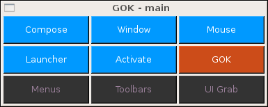

# GOK (GNOME Onscreen Keyboard)

<figure style="text-align: center">
  
</figure>

The GNOME Onscreen Keyboard (GOK) was an ATRC (now IDRC) from the early 2000s.  
It provided a way for person with motor disabilites to control their desktop.

***Dynamic*** - GOK was dynamic in two senses.  First, activating a key in the
current keyboard frequently navigated to a new keyboard with a different set of
keys.  For example, the "Main" keyboard above was made up of "Menus", "Compose",
"Window", "Mouse", "Activate", "Toolbars", "GOK", "UI Grab", and "Launcher"
keys.  If the current user context was an application with a menu bar, pressing
the "Menus" key would invoke a new keyboard that consisted of the menus in the
current menu bar.  Pressing the "File" key on that keyboard would lead to a
keyboard where each key was one of the File menu items, e.g., "New", "Open..",
"Close", "Save", "Save as...", etc.  In all cases, there was a "Back" key that
would navigate back to the just previously shown keyboard, and, in some cases,
there were special keys to immediately navigate back up an entire hierarchy
quickly rather than pressing a long series of "Back" keys.

GOK implmented a way to read a pre-defined keyboard from a keyboard description
file.  However, GOK was dynamic in a second sense where some of the keyboards
were created at runtime.  GOK had the ability, thanks to the GNOME accessibility
API, to query the current GUI and then create keys and a keyboard that
represented that aspect of the GUI.  The example noted above where GOK grabbed
the contents of the current menu bar and re-presented it as a set of keys in a
keyboard.  Another example is getting a list of all the open windows and showing
each window as a key.  Activating that key would bring the corresponding window
to the foreground.

GOK also supported a standard qwerty keyboard for text entry, as well as other
layouts including alphabetic order and a frequency order, where the most
frequent letters were near the top of the keyboard.

GOK also supported a variety of selection methods including direct selection,
single switch scanning, single switch inverse scanning, selection by joy stick,
automatic scanning, and morse code.

GOK's development and support has since ended, but the project has been [archived in GNOME's gitlab](https://gitlab.gnome.org/Archive/gok/-/tree/master).
This current "principles" project is for documenting features or ideas
implemented in GOK that might prove useful going forward.  It is not to revive
the project in its current form as an onscreen keyboard for GNOME/Linux.

## Keyboard Persistence

Some GOK keyboards were static and could be defined as data structures to be
loaded by the GOK software at run time, as needed.  The document
[GOKKeyboardPersistence.md](./GOKKeyboardPersistence.md) describes the XML
format used and suggests a way to encode the same information using JSON.

## Keyboard Layout Techniques

TBD

## Selection Methods

TBD

